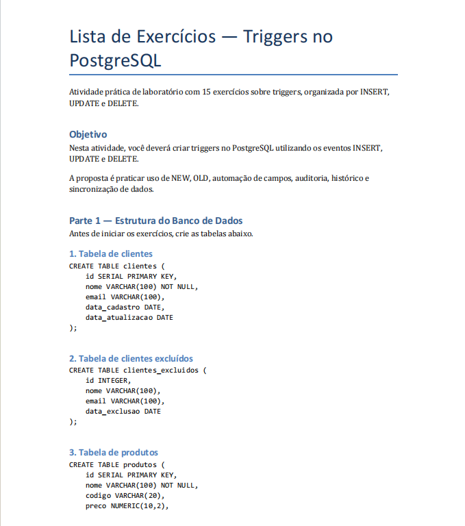
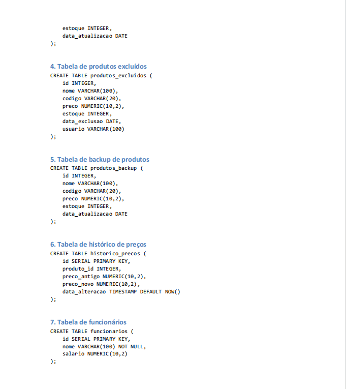
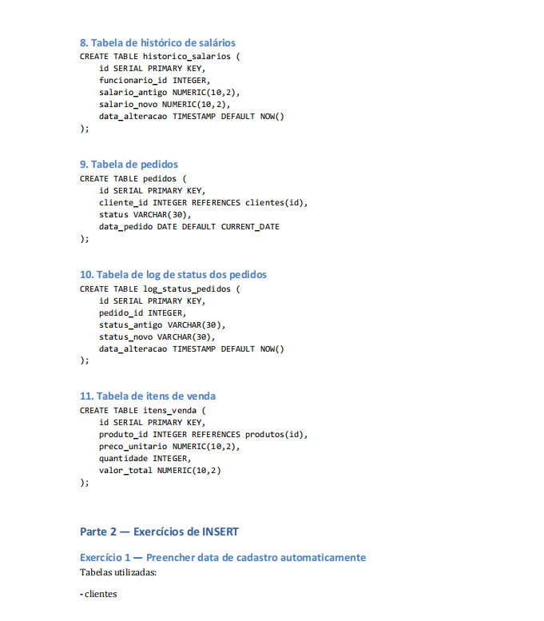
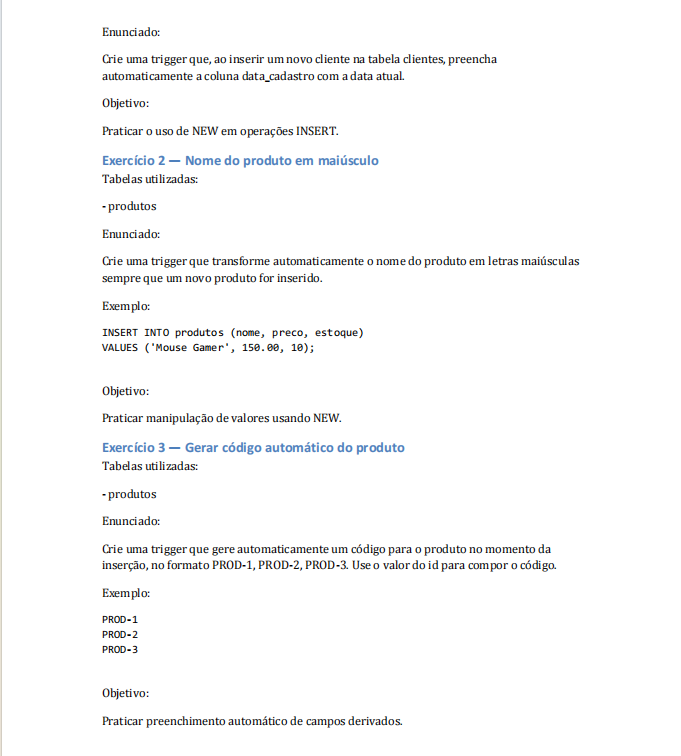
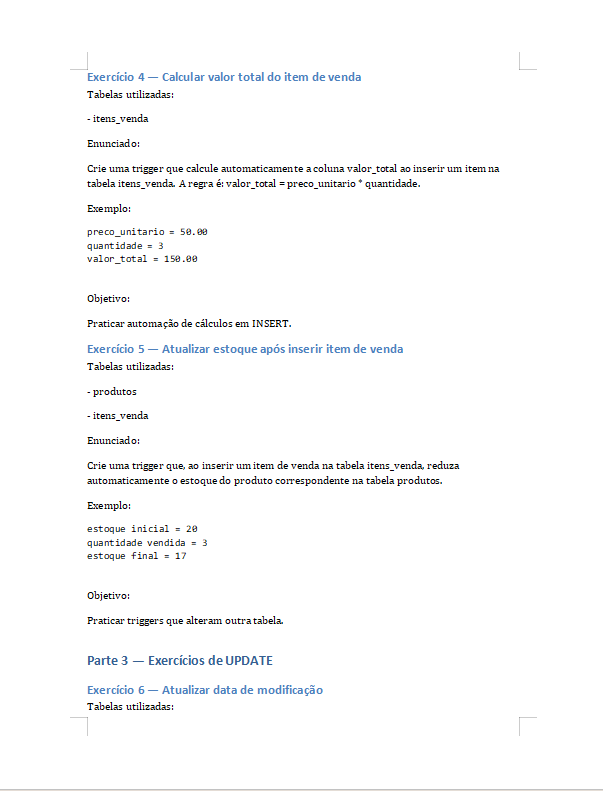
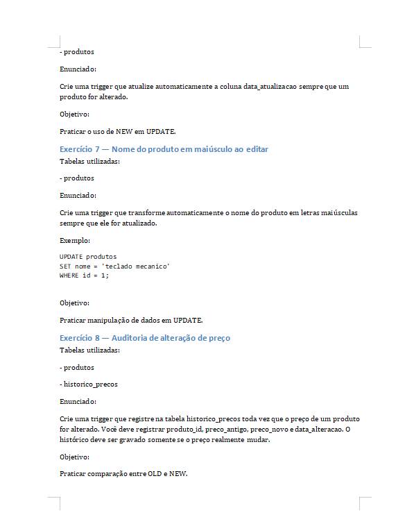
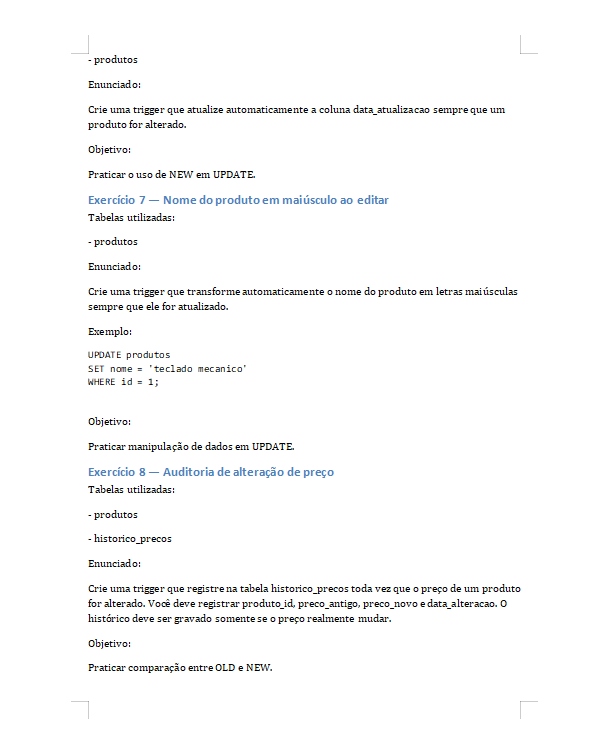
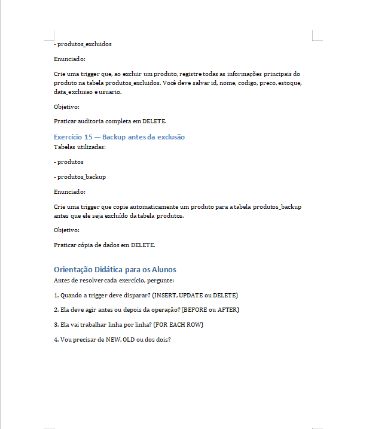

# Exercícios de PL/pgSQL

Exercícios práticos de banco de dados abordando a criação de triggers (gatilhos) e functions procedurais em PL/pgSQL no PostgreSQL, com foco em automação de regras de negócio, auditoria de dados, histórico de alterações e backup de registros.

---

## Estrutura do Banco de Dados

O banco de dados é composto pelas seguintes tabelas principais e de suporte:

* **clientes**: Cadastro básico de clientes.
* **clientes_excluidos**: Tabela de backup para histórico de clientes removidos.
* **produtos**: Catálogo de itens com controle de preço e estoque.
* **produtos_excluidos**: Log detalhado de exclusão de produtos (incluindo usuário do banco e data).
* **produtos_backup**: Cópia temporária/backup de produtos antes de sua remoção.
* **historico_precos**: Auditoria de alteração de preços de produtos.
* **funcionarios**: Cadastro de colaboradores e salários.
* **historico_salarios**: Log de alterações salariais de funcionários.
* **pedidos**: Registro de vendas.
* **log_status_pedidos**: Histórico de mudanças de status de pedidos.
* **itens_venda**: Itens pertencentes a cada pedido (com cálculo automático de valores).

---

## Exercícios Desenvolvidos

A abaixo está a relação das triggers e functions implementadas:

| Número | Script | Tabela Alvo | Evento | Função |
| :--- | :--- | :--- | :--- | :--- |
| 01 | [01_preencher_data_cadastro.sql](file:///c:/Users/sabon/Desktop/postgresql-triggers-exercises/exercises/01_preencher_data_cadastro.sql) | `clientes` | `BEFORE INSERT` | Preenche automaticamente o campo `data_cadastro` com a data atual. |
| 02 | [02_nome_produto_maiusculo.sql](file:///c:/Users/sabon/Desktop/postgresql-triggers-exercises/exercises/02_nome_produto_maiusculo.sql) | `produtos` | `BEFORE INSERT` | Converte o nome do produto para letras maiúsculas antes de salvar. |
| 03 | [03_gerar_codigo_produto.sql](file:///c:/Users/sabon/Desktop/postgresql-triggers-exercises/exercises/03_gerar_codigo_produto.sql) | `produtos` | `BEFORE INSERT` | Gera o código do produto no formato `PROD-{id}` automaticamente. |
| 04 | [04_calcular_valor_total_venda.sql](file:///c:/Users/sabon/Desktop/postgresql-triggers-exercises/exercises/04_calcular_valor_total_venda.sql) | `itens_venda` | `BEFORE INSERT` | Calcula o valor total do item (`preco_unitario * quantidade`) antes da inserção. |
| 05 | [05_atualizar_estoque_venda.sql](file:///c:/Users/sabon/Desktop/postgresql-triggers-exercises/exercises/05_atualizar_estoque_venda.sql) | `itens_venda` | `AFTER INSERT` | Atualiza o estoque do produto na tabela correspondente após uma venda. |
| 06 | [06_atualizar_data_produto.sql](file:///c:/Users/sabon/Desktop/postgresql-triggers-exercises/exercises/06_atualizar_data_produto.sql) | `produtos` | `BEFORE UPDATE` | Registra a data da última atualização do produto. |
| 07 | [07_nome_produto_maiusculo_update.sql](file:///c:/Users/sabon/Desktop/postgresql-triggers-exercises/exercises/07_nome_produto_maiusculo_update.sql) | `produtos` | `BEFORE UPDATE` | Garante que o nome do produto continue em maiúsculas após alterações. |
| 08 | [08_auditoria_alteracao_preco.sql](file:///c:/Users/sabon/Desktop/postgresql-triggers-exercises/exercises/08_auditoria_alteracao_preco.sql) | `produtos` | `AFTER UPDATE` | Salva o histórico de preços sempre que o valor de um produto mudar. |
| 09 | [09_log_status_pedido.sql](file:///c:/Users/sabon/Desktop/postgresql-triggers-exercises/exercises/09_log_status_pedido.sql) | `pedidos` | `AFTER UPDATE` | Registra a mudança de status do pedido (ex: pendente, pago). |
| 10 | [10_historico_salario_funcionario.sql](file:///c:/Users/sabon/Desktop/postgresql-triggers-exercises/exercises/10_historico_salario_funcionario.sql) | `funcionarios` | `AFTER UPDATE` | Registra alterações no histórico de salários dos funcionários. |
| 11 | [11_log_exclusao_produto.sql](file:///c:/Users/sabon/Desktop/postgresql-triggers-exercises/exercises/11_log_exclusao_produto.sql) | `produtos` | `BEFORE DELETE` | Registra a exclusão básica de um produto na tabela de auditoria. |
| 12 | [12_usuario_excluiu_produto.sql](file:///c:/Users/sabon/Desktop/postgresql-triggers-exercises/exercises/12_usuario_excluiu_produto.sql) | `produtos` | `BEFORE DELETE` | Registra a exclusão do produto e o usuário do banco responsável. |
| 13 | [13_exclusao_cliente_backup.sql](file:///c:/Users/sabon/Desktop/postgresql-triggers-exercises/exercises/13_exclusao_cliente_backup.sql) | `clientes` | `BEFORE DELETE` | Salva uma cópia do cliente deletado na tabela de clientes excluídos. |
| 14 | [14_auditoria_completa_produto_excluido.sql](file:///c:/Users/sabon/Desktop/postgresql-triggers-exercises/exercises/14_auditoria_completa_produto_excluido.sql) | `produtos` | `BEFORE DELETE` | Salva auditoria detalhada completa do produto excluído. |
| 15 | [15_backup_produto_antes_delete.sql](file:///c:/Users/sabon/Desktop/postgresql-triggers-exercises/exercises/15_backup_produto_antes_delete.sql) | `produtos` | `BEFORE DELETE` | Realiza o backup completo do produto na tabela de backups antes da remoção física. |

---

## Execução e Demonstração

As imagens abaixo, contidas no diretório `screenshots/`, exemplificam a criação da estrutura de tabelas, triggers e execução de consultas de teste no banco de dados:

### Criação de Tabelas e Visualização do Banco

### Consultas de Teste e Logs de Auditoria

---

## Como Utilizar

1. Crie um banco de dados PostgreSQL.
2. Execute o arquivo de definição de tabelas localizado em [create_tables.sql](file:///c:/Users/sabon/Desktop/postgresql-triggers-exercises/schema/create_tables.sql).
3. Execute o script contido na pasta `exercises/` correspondente à trigger que deseja carregar.
4. Realize operações de `INSERT`, `UPDATE` ou `DELETE` nas tabelas principais para verificar a execução automática dos gatilhos e o preenchimento das tabelas de auditoria e logs.

---

##  Autor
**Matheus Pereira**   
- Estudante de Engenharia de Software Faculdade de Nova Serrana  
- Apaixonado por desenvolvimento desktop  
- GitHub: https://github.com/MatheusPereiira

---
